# Architecture

The model is the small box. Trust is everything around it.

Inside the model are five steps you cannot touch: tokenizer, embeddings, transformer blocks, logits, sampling. You control only the two ends — every token that goes in (context engineering) and how the pick is made on the way out (temperature, max tokens, JSON schema). Three layers sit outside. Context engineering / RAG shapes what the model sees (**before**). Orchestration sequences the calls (**around**). Governance and guardrails gate inputs and outputs and keep the record (**after, and wrapping everything**). The model never reads the corpus directly, never sees a card image, and never decides eligibility. Vocabulary for every box: `docs/FLUENCY.md`.

```mermaid
flowchart LR
  P[Patient<br/>card photo + drug pick] --> IG

  subgraph G["3 · GOVERNANCE & GUARDRAILS (after the model, and wrapping it) — input/output guardrails · rules-as-code · tracing · evals"]
    direction LR
    IG[Input guardrails<br/>PHI detection · scope check<br/>card OCR → fields, image discarded]
    IG -. refuse: PHI / out of scope .-> X1[ ]

    subgraph C["1 · CONTEXT ENGINEERING (before the model) · RAG"]
      direction TB
      PM[Plan match<br/>card fields + 2–3 questions<br/>→ governing docs, confidence]
      PC[Ingestion & chunking — index time<br/>34 policy docs, section-aware<br/>payer · LOB · date · page]
      EM[Embeddings → vector store — index time<br/>SQLite + vector extension]
      PR[Program records<br/>DTC · copay · PAP<br/>verified_on]
      HR[Hybrid retrieval — request time<br/>semantic + keyword · metadata filter by plan · rerank]
      CP[[Context packet<br/>top-k chunks + metadata + rules excerpt<br/>the only facts the model may use]]
      PM --> PC --> EM --> HR --> CP
      PM --> PR --> HR
    end

    subgraph O["2 · ORCHESTRATION (around the model) · chains"]
      direction TB
      R[Router — routing, small cheap model<br/>lookup · compare · checklist · out of scope]
      PB[Prompt builder — prompt assembly<br/>system prompt + rules + packet + question<br/>you control every token that goes in]
      LLM[["INSIDE THE MODEL — Claude, rented, frozen<br/>1 tokenizer → 2 embeddings → 3 transformer blocks → 4 logits → 5 sampling<br/>way out: temperature ≈ 0 · max tokens · JSON schema"]]
      V[Verifier — LLM-as-judge + code<br/>every claim grounded and cited? rules applied?]
      F[Fan-out — parallel calls, Layer 2<br/>coverage · manufacturer · cash → synthesize]
      R --> PB --> LLM -- draft --> V
      V -- revise --> PB
    end

    IG -- in scope --> PM
    PM -- question --> R
    CP -- packet --> PB
    V -- verified --> OG[Output guardrails<br/>no citation → block · low confidence → abstain<br/>>30 d old → flag · not-advice framing]
    OG -. abstain, and say why .-> X2[ ]

    E[Rules-as-code — eligibility engine<br/>Medicare/Medicaid × copay cards · PAP income · Ohio ST law × plan type]
    A[Tracing — audit log, every request<br/>question · match · chunks · draft · verdict · model · cost]
    EV[Evals — golden set, regression testing, every change<br/>groundedness · abstention · PHI refusal · eligibility]
    E -- "rules, per claim" --> V
    IG -. "records refusals + plan match" .-> A
    V -. "packet · draft · verdict · model · cost" .-> A
    OG -. outcome .-> A
    EV -. "build time: replays 50 scenarios" .-> IG
    A -. "build time: scored against expected" .-> EV
  end

  OG --> ANS[Answer<br/>Layer 1: plan says · Layer 2: routes<br/>doctor summary · every line cited]
```

## What lives in each layer

**Context engineering (before).** Plan match (card fields plus confirming questions, mapped to governing documents with a confidence score); the policy corpus (34 ring-one documents, chunked so criteria tables stay intact, tagged with payer, line of business, benefit type, effective date, page); program records (DTC, copay card, assistance, each with a source URL and verified-on date); hybrid retrieval (exact match for drug names and codes, semantic for criteria language, filtered to the matched plan). Output: the context packet.

**The context packet.** A plain data object, not a component that acts. For one request it holds: the top-scoring passages from the matched plan's documents, each tagged with payer, document, version, effective date, and page; the drug's program record with its verified-on date; the plan-match result and confidence; and the excerpt of the rules file that applies. It is the entire set of facts the model may use. If a fact is not in the packet, the model may not state it, and the verifier rejects it if it does.

**Orchestration and agentic chains (around).** The prompt builder is the only component that calls the model: it assembles the rules, the packet, and the router's classification into one prompt and makes the API call; when a draft fails verification, it adds the verifier's notes and calls again. A cheap model routes the request; the strong model drafts; a verifier rejects any claim without a citation or any answer that ignores an eligibility rule; the loop repeats until the draft passes or the request abstains. Layer 2 fans out one retriever per route in parallel, then synthesizes. Model tiering: cheapest model that passes the evals for each step.

**Cognitive governance and guardrails (wrap).** Input gate (PHI check, scope check, card image processed in memory and discarded). Output gate (citation required, abstain on low confidence, freshness flag past 30 days, "not advice" framing). The three boxes along the bottom relate to a request in three different ways. The eligibility engine (Medicare/Medicaid and copay cards, income thresholds, Ohio step-therapy law versus plan type) is *consulted* by the verifier for every claim; the model never calls it. The audit log is *written to* by the input gate (refusals, plan match), the orchestration loop (packet, draft, verdict, model, cost), and the output gate (outcome); it is read by humans and by the evals, never by the live request, and retains nothing about the person. The evals never touch a live request: at build time they replay fifty golden scenarios through the same input gate a patient uses and score the audit records against expected answers. A change that lowers a score does not ship.

Solid arrows: data or a rule action during a request. Dashed: written to the record during a request. Dotted: build time only.

## One request, step by step

1. A patient photographs their card and picks Emgality. The input gate extracts carrier and RxBIN/PCN, discards the image, and checks nothing typed looks like clinical detail.
2. Plan match proposes "UnitedHealthcare, commercial, pharmacy benefit via Optum Rx" and asks two confirming questions. Confidence: high.
3. Retrieval pulls the UHC CGRP prior-authorization and step-therapy programs, filtered to that plan, plus Emgality's program records. That is the context packet.
4. The router classifies the request as a Layer 1 lookup plus a Layer 2 route comparison. The prompt builder assembles rules, packet, and classification into one prompt and makes the call.
5. The model drafts: two of seven preventive classes for two months each, the documentation the prescriber needs, the annual reauthorization rule; then the three routes with eligibility and twelve-month notes.
6. The verifier checks each claim against the packet and the eligibility engine. A sentence without a page citation goes back for revision.
7. The output gate passes the answer with its citations and framing. Had the plan been Anthem commercial, whose criteria are not public, the gate would abstain and say exactly that.

Component count inside the model box: 1. Outside it: 16. That ratio is the design.

A rendered version of this view (same content, drawn) is kept as a Claude artifact; link in DECISIONS.md.
